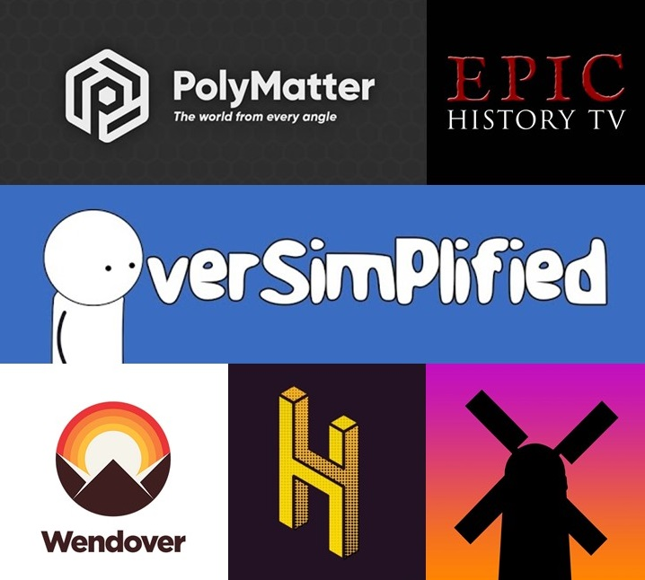

Hello! My name is Param Rathour.

I am currently an undergraduate student at the Department of Electrical Engineering, Indian Institute of Technology Bombay (Mumbai, India). I'm pursuing a Bachelor of Technology and Master of Technology in Electrical Engineering, with Control and Computing as my specialization. I have also completed a minor in Computer Science & Engineering.

<buttona class="accordion">Education</buttona>

    

I have changed a lot of schools in my childhood due to transfers.

I completed my education from 4th to 8th standard at Holy Cross Convent High School, Akola.

I then shifted to Latur and joined Podar International School, Latur, and completed my class 10, obtaining 10 CGPA in CBSE Board Examinations in 2017.

I finished my junior college (11th and 12th standard) at Rajarshi Shahu Mahavidyalaya, Latur, with 96.6% in CBSE Board Examinations in 2019.

<buttona class="accordion">Interests</buttona>

    

I am always involved in learning new stuff and its applications.

Below are some of my interests (Consider thumbnails as recommendations).
<!-- Section -->
<section>
    <header class="major">
        

        <h2>Mathematics</h2>
    </header>
        <h3>Recreational Mathematics  ε></h3>
            
            
I love mathematics. My interest developed in 10th standard after connecting with youtube channels like Numberphile, 3Blue1Brown, Mathologer and solving logic puzzles. I learnt a lot about beauty, history and applications of mathematics from books. My interest expanded when I was able to correlate these with my JEE Preparation, and that's when this became my favourite subject.

        

        <h3>Applied Mathematics</h3>
            
            
Over the years at IITB, my interest in pure and applied mathematics has only grown which led me to get invested in Theoretical Computer Science and Control Theory as well. Some of my favourite books which I have delved into are given above.

</section>

<!-- Section -->
<section>
    <header class="major">
        <h2>Entertainment</h2>
    </header>
    

        <article>
            
            <h3>Youtube</h3>
            
I watch a lot of youtube, not just educational but history, business and economics, engineering, tech and random stuff.

<!--             
My recommendations
            <ul>
                <li><a href="https://www.youtube.com/channel/UCNIuvl7V8zACPpTmmNIqP2A">Oversimplified</a></li>
                <li><a href="https://www.youtube.com/user/Top10Memes">LEMMiNO</a></li>
                <li><a href="https://www.youtube.com/channel/UCvPXiKxH-eH9xq-80vpgmKQ">Epic History TV</a></li>
                <li><a href="https://www.youtube.com/channel/UCgNg3vwj3xt7QOrcIDaHdFg">Polymatter</a></li>
                <li><a href="https://www.youtube.com/channel/UC9RM-iSvTu1uPJb8X5yp3EQ">Wendover Productions</a></li>
                <li><a href="https://www.youtube.com/channel/UCuCkxoKLYO_EQ2GeFtbM_bw">Half as Interesting</a></li>
                <li><a href="https://www.youtube.com/channel/UCP5tjEmvPItGyLhmjdwP7Ww">Real Life Lore</a></li>
            </ul>

            
Below link includes <b>educational</b> channels too.
 -->
            <ul class="actions">
                <li><a href="https://www.youtube.com/channel/UC6uZMKVYdFUhujQ4Oy6C2YQ/channels?view_as=subscriber" class="button">Featured Channels</a></li>
            </ul>
        </article>
        <article>
            
            <h3>Music</h3>
            
I love listening to music. I have quite diverse interest ranging from Old Hindi Songs to Contemporary English Songs to J-pop. My tastes vary a lot with my mood :P. Still, generally, I am more interested in cinematic music and soundtracks.

            <ul>
                <!-- <li><a href="https://youtu.be/o-ONVkhJVSA">G Minor Bach (Arr. Luo Ni)</a></li>
                <li><a href="https://youtu.be/HEf_xrgmuRI">The Wolf And The Moon by BrunuhVille</a></li>
                <li><a href="https://youtu.be/qR6dzwQahOM">L's Theme</a></li>
                <li><a href="https://youtu.be/l2kwie-gs2o">Trisha's Lullaby</a></li>
                <li><a href="https://youtu.be/xc74Bm__cP8">Only I am missing</a></li>
                <li><a href="https://youtu.be/9Pf3hkYR9T0">Someday (Believe me) by Abo Takeshi</a></li>
                <li><a href="https://youtu.be/VqrCeNjxC-c">Deeply Fast</a></li>
                <li><a href="https://youtu.be/Z4R42NALDy8">To Give a Marionette Life</a></li> -->
                <a href="https://youtube.com/playlist?list=PL_oWkLvcB4HN0Ik1-V_TrYZpnQJ9s8hK2" class="button">Cinematic Music</a>
                <a href="https://youtube.com/playlist?list=PL_oWkLvcB4HOoLRN3uzNSLOXSTqanH3x7" class="button">Western Songs</a>
                

                <a href="https://youtube.com/playlist?list=PL_oWkLvcB4HOdCAn_Xgu4_0lC9KwJzaTJ" class="button">Anime OSTs</a>
                <a href="https://youtube.com/playlist?list=PL_oWkLvcB4HPWO9x3au0BXFI-crB2GRPg" class="button">Anime Songs</a>
            </ul>
        </article>
        <article>
            
            <h3>Anime</h3>
            
I started watching 'anime' quite recently (in 11th standard), and I was hooked to it instantly. Action, Adventure, Comedy, Drama, Fantasy, Gore, Historical, Horror, Miltary, Mystery, Psychological, Romance, School, Sci-fi, Slice of Life, Sports, Supernatural, Time Travel, Thriller or Tragedy; I have watched them all :D

            <a href="Anime" class="button">My Anime page</a>
        </article>
        <article>
            
            <h3>T.V. Series</h3>
            
This one is even recent. First watched during this 'corona' time.

            <a href="https://www.serializd.com/user/wrath" class="button">My T.V. Series page</a>
            

        </article>
        <article>
            
            <h3>Novels</h3>
            
I like reading stories with Harry Potter being my favourite. However, I haven't read a lot of books lately. I am planning to start reading again someday, sometime :).

        </article>
        <article>
            
            <h3>Sports</h3>
            
I like playing and watching cricket and badminton.
            I started playing football in NCC sports sessions during my first year. I have enthusiasm for learning new games and will try more.

            
My favourite team (of course after <b style="color:rgb(34, 85, 164);">India</b>) - <b class="noinversion" style="color:rgb(249,205,5);">CSK</b>

        </article>
    

</section>

Phew! Lot of things to do whensoever.

<buttona class="accordion">Miscellaneous</buttona>

    

<!-- Section -->
<section>
    <header class="major">
        <h2>More</h2>
    </header>
    

        <article>
            <a href="/Time Table"></a>
            

                <h3>Time Table</h3>
                
My academic <a href="/Time Table">Time Table</a>.

            

        </article>
        <article>
            <a href="/Courses"></a>
            

                <h3>Courses</h3>
                
List of <a href="/Courses">Courses</a> that I have taken and am taking.

            

        </article>
        <!--article>
            <a href="/Blog"></a>
            

                <h3>Blog</h3>
                
My <a href="/Blog">Blog</a>.

            

        </article-->
        <article>
            <a href="/Projects"></a>
            

                <h3>Projects</h3>
                
List of some of my <a href="/Projects">Projects</a>.

            

        </article>
        <article>
            <a href="/Random Stuff"></a>
            

                <h3>Random Stuff</h3>
                
<a href="/Random Stuff">Random Things</a>.

            

        </article>
    

</section>

